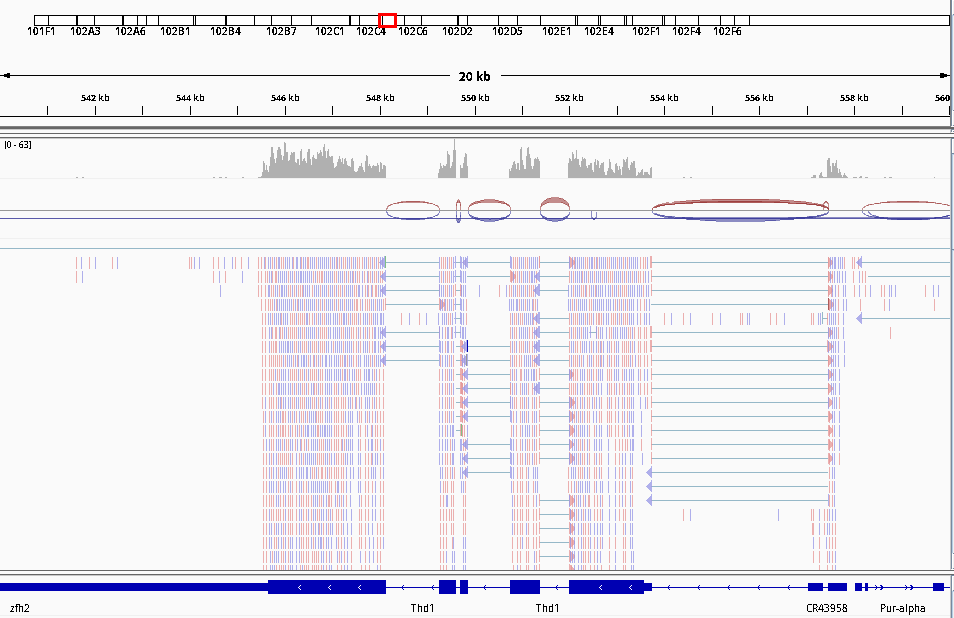
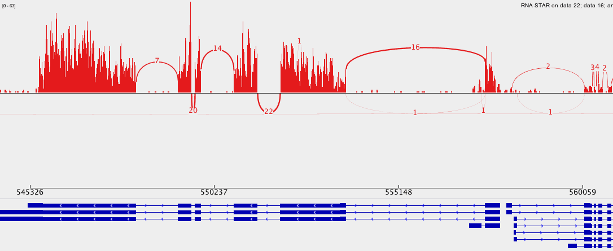
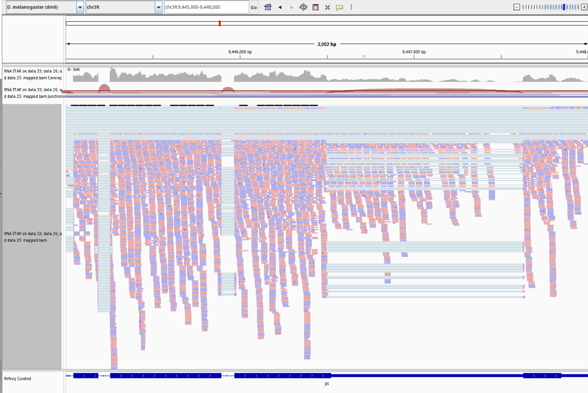
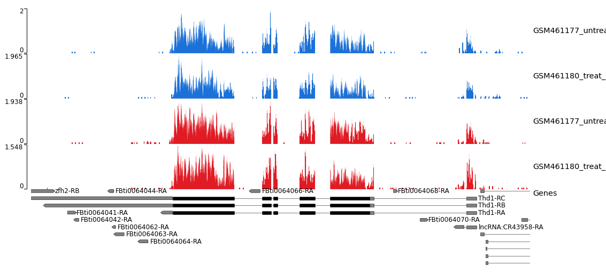
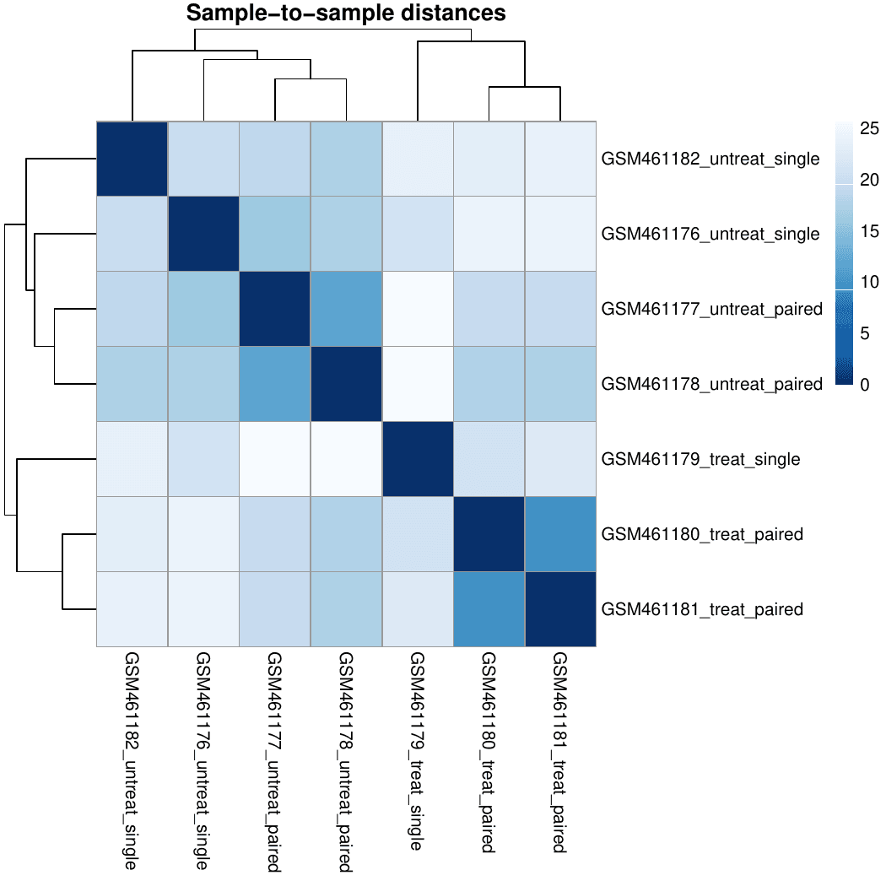
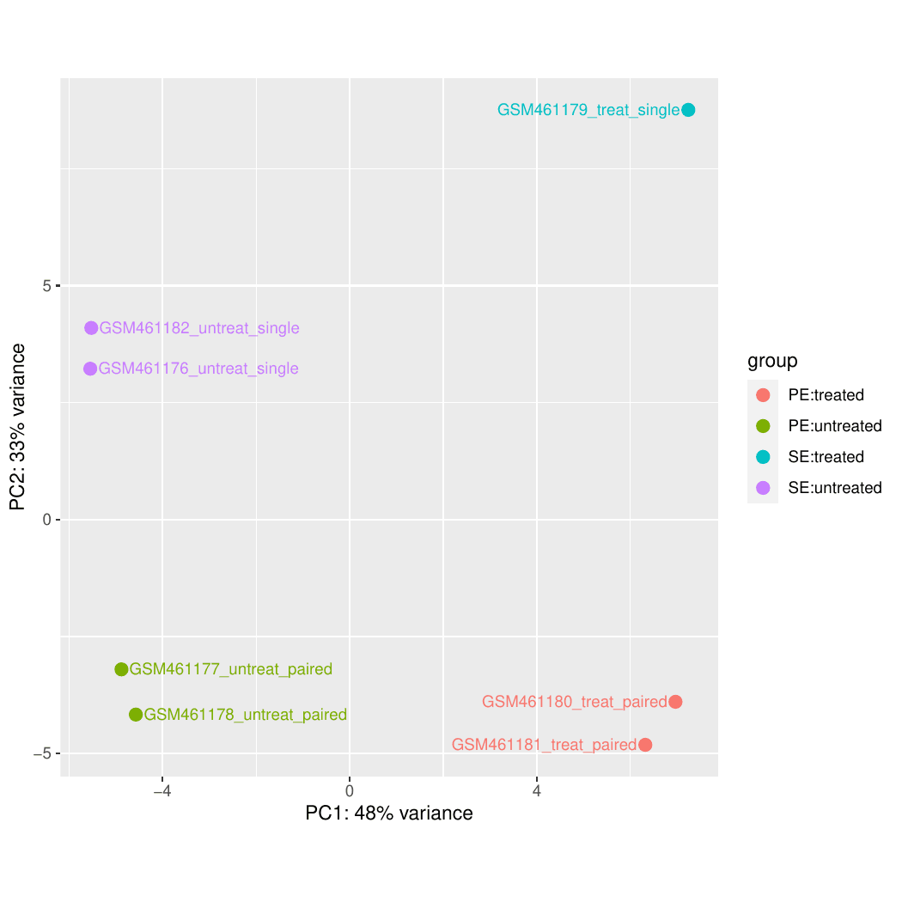

# Reference-based-RNA-Seq-data-analysis
Reference-based RNA-Seq analysis of Drosophila melanogaster Pasilla gene knockdown  using Galaxy — QC, STAR mapping, featureCounts, DESeq2, GO &amp; KEGG enrichment analysis.

> **Organism:** *Drosophila melanogaster*

> **Study:** Pasilla gene knockdown

> **Samples:** 4 untreated + 3 treated (PS-RNAi depleted)

> **Platform:** [Galaxy](https://usegalaxy.org) | **Reference Genome:** dm6

> **GEO Accession:** [GSE18508](https://www.ncbi.nlm.nih.gov/geo/query/acc.cgi?acc=GSE18508)

---

## Overview

This repository documents a complete **reference-based RNA-Seq analysis pipeline**
executed on the [Galaxy platform](https://usegalaxy.org), based on the
[Galaxy Training Network (GTN) tutorial](https://training.galaxyproject.org/training-material/topics/transcriptomics/tutorials/ref-based/tutorial.html)

The study investigates transcriptomic alterations in *Drosophila melanogaster*
following RNAi-mediated depletion of the *Pasilla* (PS) gene — the fly homologue
of the mammalian splicing regulators Nova-1 and Nova-2. The pipeline spans the
complete analytical workflow: raw read quality assessment, splice-aware alignment,
strand-specific coverage visualization, read quantification, differential expression
analysis, and functional enrichment, producing reproducible outputs at each stage.

---

## Table of Contents

1. [Dataset](#1-dataset)
2. [Pipeline Architecture](#2-pipeline-architecture)
3. [Data Upload](#3-data-upload)
4. [Quality Control](#4-quality-control)
5. [Alignment — RNA STAR](#5-alignment--rna-star)
6. [Inspection of Mapping Results](#6-inspection-of-mapping-results)
   - [6.1 MultiQC on STAR Logs](#61-multiqc-on-star-logs)
   - [6.2 IGV — Integrative Genomics Viewer](#62-igv--integrative-genomics-viewer)
   - [6.3 Sashimi Plot](#63-sashimi-plot)
   - [6.4 JBrowse2](#64-jbrowse2)
   - [6.5 STAR Strand-Specific Coverage](#65-star-strand-specific-coverage)
7. [Estimation of Library Strandedness](#7-estimation-of-library-strandedness)
8. [Read Counting — featureCounts](#8-read-counting--featurecounts)
9. [Differential Expression Analysis — DESeq2](#9-differential-expression-analysis--deseq2)
10. [Annotation of DESeq2 Results](#10-annotation-of-deseq2-results)
11. [Extraction of Differentially Expressed Genes](#11-extraction-of-differentially-expressed-genes)
12. [Visualization of DE Gene Expression](#12-visualization-of-de-gene-expression)
    - [12.1 PCA Plot](#121-pca-plot)
    - [12.2 Sample-to-Sample Distance Heatmap](#122-sample-to-sample-distance-heatmap)
    - [12.3 Top DE Genes Heatmap](#123-top-de-genes-heatmap)
13. [Gene Ontology Enrichment Analysis](#13-gene-ontology-enrichment-analysis)
14. [KEGG Pathway Analysis](#14-kegg-pathway-analysis)
15. [Results Summary](#15-results-summary)
16. [Repository Structure](#16-repository-structure)
17. [References](#17-references)

---

## 1. Dataset

Seven biological samples from NCBI GEO
([GSE18508](https://www.ncbi.nlm.nih.gov/geo/query/acc.cgi?acc=GSE18508)),
available on [Zenodo (DOI: 10.5281/zenodo.6457007)](https://zenodo.org/record/6457007),
were used across two experimental conditions. Samples GSM461177 and GSM461180
(both paired-end) were used for the alignment and counting demonstration;
all seven samples were used for differential expression analysis.

| Sample ID  | Condition      | Library Type | Replicate | GEO Link |
|------------|----------------|--------------|-----------|----------|
| GSM461176  | Untreated      | Single-End   | 1         | [Link](https://www.ncbi.nlm.nih.gov/geo/query/acc.cgi?acc=GSM461176) |
| GSM461177  | Untreated      | Paired-End   | 2         | [Link](https://www.ncbi.nlm.nih.gov/geo/query/acc.cgi?acc=GSM461177) |
| GSM461178  | Untreated      | Single-End   | 3         | [Link](https://www.ncbi.nlm.nih.gov/geo/query/acc.cgi?acc=GSM461178) |
| GSM461182  | Untreated      | Single-End   | 4         | [Link](https://www.ncbi.nlm.nih.gov/geo/query/acc.cgi?acc=GSM461182) |
| GSM461179  | Treated (RNAi) | Single-End   | 1         | [Link](https://www.ncbi.nlm.nih.gov/geo/query/acc.cgi?acc=GSM461179) |
| GSM461180  | Treated (RNAi) | Paired-End   | 2         | [Link](https://www.ncbi.nlm.nih.gov/geo/query/acc.cgi?acc=GSM461180) |
| GSM461181  | Treated (RNAi) | Single-End   | 3         | [Link](https://www.ncbi.nlm.nih.gov/geo/query/acc.cgi?acc=GSM461181) |

---

## 2. Pipeline Architecture

The following diagram represents the complete end-to-end analytical workflow,
from raw FASTQ input through functional enrichment output.

```
┌─────────────────────────────────────────────────────────────────────┐
│                     RAW INPUT DATA                                  │
│         FASTQ files — Zenodo DOI: 10.5281/zenodo.6457007            │
│   GSM461177 (PE, untreated) │ GSM461180 (PE, treated/PS-RNAi)      │
└───────────────────────────┬─────────────────────────────────────────┘
                            │
                            ▼
          ┌─────────────────────────────────┐
          │     QUALITY CONTROL             │
          │   Falco  ──►  MultiQC           │──► QC Summary Report
          └─────────────────┬───────────────┘
                            │
                            ▼
          ┌─────────────────────────────────┐
          │     SPLICE-AWARE ALIGNMENT      │    ┌──────────────────────┐
          │         RNA STAR (dm6)          │──► │ BAM (sorted)         │
          │                                 │    │ ReadsPerGene.tab     │
          │                                 │    │ SJ.out (junctions)   │
          │                                 │    │ BigWig Str1 (🔵 Blue)│
          │                                 │    │ BigWig Str2 (🔴 Red) │
          └─────────────────┬───────────────┘    └──────────────────────┘
                            │
                            ▼
          ┌──────────────────────────────────────────────┐
          │         ALIGNMENT VISUALIZATION               │
          │  MultiQC (STAR logs)                         │
          │  IGV ──► Read coverage at Pasilla locus      │
          │  Sashimi Plot ──► Splice junction usage      │
          │  JBrowse2 ──► Interactive genome browser     │
          │  BigWig tracks ──► Strand1=Blue, Strand2=Red │
          └─────────────────┬────────────────────────────┘
                            │
                            ▼
          ┌─────────────────────────────────┐
          │   STRANDEDNESS ESTIMATION       │
          │     Infer Experiment (RSeQC)    │──► Reverse-stranded confirmed
          └─────────────────┬───────────────┘    (featureCounts param = 2)
                            │
                            ▼
          ┌─────────────────────────────────┐
          │      READ QUANTIFICATION        │
          │       featureCounts             │──► Count matrix
          │  (All 7 samples × ~14,000 genes)│    (genes × samples)
          └─────────────────┬───────────────┘
                            │
                            ▼
          ┌─────────────────────────────────┐    ┌──────────────────────┐
          │   DIFFERENTIAL EXPRESSION       │    │ DE result table      │
          │          DESeq2                 │──► │ PCA plot             │
          │  (design: ~library_type +       │    │ Sample heatmap       │
          │           condition)            │    │ MA plot              │
          │                                 │    │ Dispersion plot      │
          └─────────────────┬───────────────┘    └──────────────────────┘
                            │
                            ▼
          ┌─────────────────────────────────┐
          │    ANNOTATION & FILTERING       │
          │  Annotate DESeq2 output         │──► Gene symbols + descriptions
          │  Filter: padj < 0.05            │
          │          |log2FC| > 1           │──► ~1,200 significant DE genes
          └─────────────────┬───────────────┘
                            │
                            ▼
          ┌─────────────────────────────────┐
          │    EXPRESSION VISUALIZATION     │
          │  heatmap2 ──► Top 50 DE genes   │
          │  Volcano plot ──► FC vs. padj   │
          └─────────────────┬───────────────┘
                            │
                            ▼
          ┌─────────────────────────────────┐
          │   FUNCTIONAL ENRICHMENT         │
          │  goseq ──► GO (BP / MF / CC)    │──► RNA splicing, mRNA binding
          │  goseq + pathview ──► KEGG      │──► Spliceosome (dme03040)
          └─────────────────────────────────┘
```

| Stage                    | Tool(s)                    | Version     |
|--------------------------|----------------------------|-------------|
| Quality Control          | Falco, MultiQC             | Latest      |
| Splice-aware Alignment   | RNA STAR                   | 2.7.x       |
| Alignment Visualization  | IGV, Sashimi, JBrowse2     | 2.16+ / Latest |
| Strandedness Estimation  | Infer Experiment (RSeQC)   | 4.x         |
| Read Quantification      | featureCounts (Subread)    | 2.x         |
| Differential Expression  | DESeq2                     | 1.38+       |
| Result Annotation        | Annotate DESeq2 (Galaxy)   | Latest      |
| GO Enrichment            | goseq                      | 1.50+       |
| KEGG Pathway Analysis    | goseq + pathview           | Latest      |

---

## 3. Data Upload

Raw FASTQ files were imported into a new Galaxy history from
[Zenodo](https://zenodo.org/record/6457007) using the Paste/Fetch Data
upload interface. Files were assigned the `fastqsanger` datatype.

```
https://zenodo.org/record/6457007/files/GSM461177_1.fastqsanger
https://zenodo.org/record/6457007/files/GSM461177_2.fastqsanger
https://zenodo.org/record/6457007/files/GSM461180_1.fastqsanger
https://zenodo.org/record/6457007/files/GSM461180_2.fastqsanger
```

Full dataset files are approximately **1.5 GB each**. Subsets (~50 MB)
are available for rapid pipeline testing.

The four files were subsequently organized into a paired dataset
collection named **`2 PE fastqs`**, with each pair identified by
sample name and condition.

---

## 4. Quality Control

Sequencing quality was assessed using **Falco**, an efficiency-optimized
rewrite of FastQC, followed by adapter trimming with **Cutadapt**. All
reports were aggregated using **MultiQC**.

---

### 4.1 Flatten Collection

As MultiQC does not support list-of-pairs collections, the `2 PE fastqs`
paired collection was first converted into a simple list using the
**Flatten Collection** tool prior to Falco execution.

| Parameter          | Value          |
|--------------------|----------------|
| Input Collection   | `2 PE fastqs`  |

---

### 4.2 Falco — Per-Sample Quality Assessment

**Falco** `v1.2.4+galaxy0` was run on the flattened collection to generate
per-file sequence quality reports.

| Parameter                                  | Value                                      |
|--------------------------------------------|--------------------------------------------|
| Raw read data from your current history    | Output of Flatten Collection (Dataset collection) |

---

### 4.3 MultiQC — Aggregation of Falco Reports

**MultiQC** `v1.27+galaxy4` was used to consolidate all individual Falco
reports into a single comparative summary. Falco output is passed as
FastQC-compatible input, as Falco is a drop-in replacement for FastQC.

| Parameter                  | Value                                              |
|----------------------------|----------------------------------------------------|
| Which tool generated logs? | FastQC (Falco as drop-in replacement)              |
| FastQC output              | Falco on collection N: RawData (Dataset collection)|

---

### 4.4 Cutadapt — Quality Trimming and Filtering

**Cutadapt** `v5.2+galaxy0` was applied to the `2 PE fastqs` paired
collection to remove low-quality bases and short reads.

| Parameter                        | Value                        |
|----------------------------------|------------------------------|
| Read type                        | Paired-end Collection        |
| Paired Collection                | `2 PE fastqs`                |
| Quality cutoff R1                | 20                           |
| Minimum length R1                | 20                           |
| Additional output                | Report (per-adapter statistics) |

---

### 4.5 MultiQC — Aggregation of Cutadapt Reports

**MultiQC** `v1.27+galaxy4` was run a second time to aggregate the
Cutadapt per-adapter statistics reports.

| Parameter                  | Value                                                        |
|----------------------------|--------------------------------------------------------------|
| Which tool generated logs? | Cutadapt/Trim Galore!                                        |
| Output of Cutadapt         | Cutadapt on collection N: Report (Dataset collection)        |

<!-- INSERT IMAGE: MultiQC aggregated Cutadapt report -->

> *Figure 1: MultiQC FastQC Status Checks heatmap across 4 samples
> (GSM461177 forward/reverse, GSM461180 forward/reverse).*

### Quality Control Summary

- **Adapter content, duplication levels, and sequence length distribution**
  pass across all four samples — no critical issues detected.
- **Per Base Sequence Content** fails in all samples — expected in RNA-Seq
  data due to random hexamer priming bias at the 5′ end; not a quality concern.
- **Per Tile Sequence Quality** fails in GSM461177 (forward/reverse) —
  reflects localized flow cell tile artifacts; does not impact mapping quality.
- **Overrepresented Sequences** warns in GSM461177 reverse and GSM461180
  reverse — addressed downstream by Cutadapt trimming.
- **Per Sequence GC Content** warns in GSM461180 forward — minor deviation
  from expected distribution; acceptable for downstream analysis.

---

## 5. Mapping

Trimmed reads were mapped to the *Drosophila melanogaster* genome using
**RNA STAR** `v2.7.11b+galaxy0`, a splice-aware aligner suited for RNA-Seq data.

---

### 5.1 Reference Annotation Import

The Ensembl gene annotation file was imported from Zenodo into the current
Galaxy history and verified to be in **GTF** format (not GFF).

```
https://zenodo.org/record/6457007/files/Drosophila_melanogaster.BDGP6.32.109_UCSC.gtf.gz
```

| Detail       | Value                                              |
|--------------|----------------------------------------------------|
| File         | `Drosophila_melanogaster.BDGP6.32.109_UCSC.gtf.gz`|
| Datatype     | `gtf` / `gtf.gz`                                  |
| Source       | Ensembl BDGP6.32 release 109 (UCSC-formatted)     |

---

### 5.2 RNA STAR — Spliced Alignment

**RNA STAR** `v2.7.11b+galaxy0` was run on the Cutadapt-trimmed paired
collection using the dm6 built-in genome index and the imported GTF for
splice junction annotation.

| Parameter                                  | Value                                                        |
|--------------------------------------------|--------------------------------------------------------------|
| Read type                                  | Paired-end (as collection)                                   |
| RNA-Seq FASTQ paired reads                 | Cutadapt on collection N: Reads                              |
| Reference genome                           | Built-in index                                               |
| Genome / annotation mode                   | Genome reference without built-in gene model (GTF provided)  |
| Reference genome                           | Fly (*Drosophila melanogaster*): dm6 Full                    |
| Gene model (GTF) file                      | `Drosophila_melanogaster.BDGP6.32.109_UCSC.gtf.gz`          |
| Junction overhang length                   | 36 *(read length − 1)*                                       |
| Per gene/transcript output                 | Per gene read counts (GeneCounts)                            |
| Compute coverage                           | Yes — bedgraph format                                        |

---

### 5.3 MultiQC — Aggregation of STAR Logs

**MultiQC** `v1.27+galaxy4` was used to aggregate the STAR alignment
log files across all samples into a unified mapping summary.

| Parameter                  | Value                                          |
|----------------------------|------------------------------------------------|
| Which tool generated logs? | STAR                                           |
| Type of STAR output        | Log                                            |
| STAR log output            | RNA STAR on collection N: log (Dataset collection) |

---

## 6. Inspection of Mapping Results

Alignment results were inspected visually using two genome browsers:
**IGV** (locally) and **JBrowse2** (integrated in Galaxy), both focused
on the region `chr4:540,000–560,000`.

---

### 6.1 IGV — Local Visualization

Reads were loaded into IGV directly from Galaxy using the built-in
visualize interface.

- Open the **RNA STAR on collection N: mapped.bam** collection in Galaxy.
- Expand `GSM461177_untreat_paired` → click the **visualize (chart) icon**.
- Select **local in display with IGV (local, D. melanogaster dm6)**.
- Zoom to `chr4:540,000–560,000`.
- Right-click any track → **Sashimi Plot** to inspect splice junctions.


> *Figure 2: IGV view of chr4:540,000–560,000 showing read pileups across
> genes zfh2, Thd1, CR43958, and Pur-alpha for both samples.*

**IGV Sashimi Plot observations:**
- Arched lines represent **splice junctions** with junction read counts
  (e.g., 7, 14, 16, 20, 22, 34) confirming active splicing events.
- High read coverage clusters align with annotated exons of **Thd1** and
  neighboring genes on chr4.
- Long-range junctions (e.g., junction 16) indicate **multi-exon skipping**
  or distal splice events across the locus.


> *Figure 3: Sashimi plot of RNA STAR output — splice junction arcs with
> read support counts overlaid on the coverage track.*

---

### 6.2 JBrowse2 — Galaxy-Integrated Visualization

**JBrowse2** `v3.6.5+galaxy1` was configured with BAM and GTF tracks
for both samples.

| Parameter                  | Value                                                      |
|----------------------------|------------------------------------------------------------|
| Action                     | New JBrowse Instance                                       |
| Reference genome           | Fly (*D. melanogaster*): dm6 Full                          |
| Default region             | `chr4:540000..560000`                                      |
| BAM Track Data             | RNA STAR on collection N: mapped.bam                       |
| Track Category (BAM)       | BAM Pileups                                                |
| GFF Track Data             | `Drosophila_melanogaster.BDGP6.32.109_UCSC.gtf.gz`        |
| Track Category (Genes)     | GFF/GFF3/BED Features                                      |


> *Figure 4: JBrowse2 view of chr4:540,000–560,000 — BAM pileup tracks
> for GSM461180_treat_paired and GSM461177_untreat_paired alongside the
> GTF gene annotation.*

**JBrowse2 observations:**
- Both **treated** (GSM461180) and **untreated** (GSM461177) samples show
  clear read pileups over annotated exons, confirming successful alignment.
- Splice junction arcs are visible across both samples, consistent with
  the expected multi-exon gene structures in the region.
- Visible **coverage differences** between treated and untreated tracks
  suggest differential expression — formally quantified in the next step.

---

## 7. Estimation of Library Strandedness

Before quantification, the strandness of the RNA-Seq library was estimated
using four complementary approaches: visual inspection in **IGV** and
**JBrowse2**, strand-specific coverage plots via **pyGenomeTracks**, STAR
gene counts via **MultiQC**, and computational inference using **Infer Experiment**.

---

### 7.1 Visual Inspection — IGV (chr3R:9,445,000–9,448,000)

- Open `GSM461177_untreat_paired` mapped.bam in IGV.
- Zoom to `chr3R:9,445,000–9,448,000`.
- Right-click track → **Color Alignments by → First-of-pair strand**.
- Right-click → **Squished** for compact view.


> *Figure 5: IGV view at chr3R:9,445,000–9,448,000 colored by first-of-pair
> strand — coverage, junction, and read tracks shown for GSM461177.*

**Key observations:**
- Reads are colored by first-of-pair strand (red = reverse, blue = forward),
  revealing a clear strand bias across the locus.
- Junction track confirms active splicing at the *ps* gene locus.
- The dominant strand color indicates a **stranded library** orientation.

---

### 7.2 Visual Inspection — JBrowse2 (chr3R:9,445,000–9,448,000)

- Zoom to `chr3R:9445000..9448000`.
- Click **⋮** next to each BAM track → **Pileup settings → Color by →
  First-of-pair strand**.
- Click **⋮** → **Pileup settings → Set feature height → Compact**.
- Repeat for both BAM files.


> *Figure 6: JBrowse2 view at chr3R:9,415,001–9,462,900 — both
> GSM461177_untreat_paired and GSM461180_treat_paired colored by
> first-of-pair strand alongside the GTF annotation track.*

**Key observations:**
- Both samples display a consistent strand color pattern across the region,
  confirming **strand-specific sequencing**.
- Read orientation is uniform within each gene, consistent with a
  **reverse-stranded** library protocol.
- GTF annotation track aligns with read pileup boundaries, validating
  correct genome coordinate mapping.

---

### 7.3 pyGenomeTracks — Strand-Specific Coverage (chr4:540,000–560,000)

**pyGenomeTracks** `v3.9+galaxy0` was used to visualize STAR-generated
strand-specific bedgraph coverage for both samples simultaneously.

| Track                  | Data Source                                      | Color | Height |
|------------------------|--------------------------------------------------|-------|--------|
| Bedgraph (Strand 1)    | RNA STAR: Coverage Uniquely mapped strand 1      | Blue  | 3      |
| Bedgraph (Strand 2)    | RNA STAR: Coverage Uniquely mapped strand 2      | Red   | 3      |
| Gene track             | `Drosophila_melanogaster.BDGP6.32.109_UCSC.gtf.gz` | —   | 5      |

- **Region plotted:** `chr4:540,000–560,000`
- Plot title left empty so sample names appear as track labels.


> *Figure 7: pyGenomeTracks output — blue tracks (strand 1) and red tracks
> (strand 2) for GSM461177 and GSM461180, with gene annotation below.*

**Key observations:**
- **Strand 2 (red)** shows substantially higher coverage than strand 1
  (blue) across all annotated exons for both samples.
- The asymmetry between strands confirms the library is **reverse-stranded**
  (reads map predominantly to the antisense strand).
- Coverage profiles align precisely with annotated exon boundaries of
  Thd1 and neighboring genes, confirming accurate spliced alignment.

---

### 7.4 STAR Gene Counts — MultiQC Aggregation

**MultiQC** `v1.27+galaxy4` was used to aggregate STAR gene count outputs,
which report read assignments under three strandness scenarios.

| Parameter                  | Value                                                    |
|----------------------------|----------------------------------------------------------|
| Which tool generated logs? | STAR                                                     |
| Type of STAR output        | Gene counts                                              |
| STAR gene count output     | RNA STAR on collection N: reads per gene (Dataset collection) |

> The strandness condition assigning the **most reads to genes** identifies
> the correct library type — confirming **reverse-stranded** in this dataset.

---

### 7.5 Infer Experiment — Computational Strandness Inference

**Convert GTF to BED12** `v357` was first run to prepare the reference
gene model, then **Infer Experiment** `v5.0.3+galaxy0` was applied.

| Parameter               | Value                                              |
|-------------------------|----------------------------------------------------|
| Input BAM               | RNA STAR on collection N: mapped.bam               |
| Reference gene model    | BED12 output of Convert GTF to BED12               |
| Reads sampled           | 200,000                                            |

**Output interpretation for paired-end libraries:**

- `1++,1--,2+-,2-+` → fraction assigned to **forward strand**
- `1+-,1-+,2++,2--` → fraction assigned to **reverse strand**
- If both fractions are **close to 0.5** → library is **unstranded**
- If one fraction dominates (e.g., >0.8) → library is **stranded**

> In this dataset, the reverse-strand fraction dominates, confirming a
> **reverse-stranded paired-end library** — consistent with all visual
> and coverage-based evidence above.

---

## 8. Read Counting — featureCounts

During mapping, RNA STAR generated per-gene read counts using the
**GeneCounts** option. The raw output contains 4 header lines and
3 count columns (unstranded, stranded forward, stranded reverse).
This section reformats that output into a clean 2-column table
compatible with featureCounts and downstream tools.

---

### 8.1 Reformat STAR Output

**Step 1 — Remove the first 4 header lines:**

| Parameter       | Value                                              |
|-----------------|----------------------------------------------------|
| Remove first    | 4 lines                                            |
| Text file       | RNA STAR on collection N: reads per gene           |

**Step 2 — Extract gene ID and count columns:**

| Parameter       | Value                                              |
|-----------------|----------------------------------------------------|
| Cut columns     | `c1,c2`                                            |
| Delimited by    | Tab                                                |
| From            | Output of Remove beginning tool (Dataset collection)|

> **Column selection note:** `c1` = gene ID, `c2` = unstranded counts.
> For a reverse-stranded library (as confirmed in Section 7), use `c4`
> instead of `c2`.

- Rename the resulting collection → **`FeatureCount-like files`**

---

### 8.2 Gene Length Calculation

Gene lengths are required for normalization methods such as RPKM/FPKM/TPM.
**Gene length and GC content** `v0.1.2` was run to extract gene lengths
from the GTF annotation.

| Parameter              | Value                                              |
|------------------------|----------------------------------------------------|
| GTF source             | Use a GTF from history                             |
| GTF file               | `Drosophila_melanogaster.BDGP6.32.109_UCSC.gtf.gz`|
| Analysis to perform    | Gene lengths only                                  |

> The output provides per-gene effective lengths used in the
> normalization step during differential expression analysis.

---

## 9. Differential Expression Analysis — DESeq2

To identify genes differentially expressed upon PS depletion, count files
from all 7 samples (3 treated, 4 untreated) were analyzed using **DESeq2**
`v2.11.40.8+galaxy0`, accounting for both treatment condition and
sequencing type (paired-end vs. single-end).

---

### 9.1 Data Import

A new Galaxy history was created and the following 7 featureCounts files
were imported from Zenodo:

```
https://zenodo.org/record/6457007/files/GSM461176_untreat_single_featureCounts.counts
https://zenodo.org/record/6457007/files/GSM461177_untreat_paired_featureCounts.counts
https://zenodo.org/record/6457007/files/GSM461178_untreat_paired_featureCounts.counts
https://zenodo.org/record/6457007/files/GSM461179_treat_single_featureCounts.counts
https://zenodo.org/record/6457007/files/GSM461180_treat_paired_featureCounts.counts
https://zenodo.org/record/6457007/files/GSM461181_treat_paired_featureCounts.counts
https://zenodo.org/record/6457007/files/GSM461182_untreat_single_featureCounts.counts
```

---

### 9.2 DESeq2 Configuration

Two factors were specified to account for treatment effect and
sequencing type as a confounding variable.

| Factor        | Level      | Samples                              |
|---------------|------------|--------------------------------------|
| **Treatment** | treated    | GSM461179, GSM461180, GSM461181      |
| **Treatment** | untreated  | GSM461176, GSM461177, GSM461178, GSM461182 |
| **Sequencing**| PE         | GSM461177, GSM461178, GSM461180, GSM461181 |
| **Sequencing**| SE         | GSM461176, GSM461179, GSM461182      |

**Additional parameters:**

| Parameter            | Value                                      |
|----------------------|--------------------------------------------|
| Files have header    | Yes                                        |
| Input data type      | Count data (featureCounts/HTSeq-count)     |
| Use beta priors      | Yes                                        |
| Output               | Plots + Normalised counts                  |

---

### 9.3 DESeq2 Outputs

**1 — Normalised counts table**
- Rows = genes, Columns = samples.
- Used for downstream visualization and exploration.

**2 — Graphical summary**
- PCA plot, sample-to-sample distance heatmap, dispersion estimates,
  p-value histogram, and MA plot (see below).

**3 — Results summary table** (per gene):

| Column                  | Description                                      |
|-------------------------|--------------------------------------------------|
| Gene ID                 | Ensembl gene identifier                          |
| Mean normalized counts  | Average expression across all samples            |
| Log2 fold change        | treated vs. untreated (positive = upregulated)   |
| Standard error          | SE of the log2FC estimate                        |
| Wald statistic          | Test statistic                                   |
| p-value                 | Raw significance                                 |
| Adjusted p-value (FDR)  | Benjamini-Hochberg corrected; threshold < 0.1    |

---

### 9.4 Quality Visualizations

#### Sample-to-Sample Distance Heatmap


> *Figure 8: Hierarchical clustering heatmap of sample-to-sample distances
> based on normalized counts. Dark blue = low distance (high similarity).*

**Key observations:**
- Treated samples (GSM461179, GSM461180, GSM461181) cluster tightly
  together, clearly separated from untreated samples.
- Untreated samples form two sub-clusters by sequencing type —
  single-end (GSM461176, GSM461182) and paired-end (GSM461177, GSM461178).
- The clean separation between conditions confirms a strong and
  reproducible treatment effect across all replicates.

---

#### Principal Component Analysis (PCA)


> *Figure 9: PCA plot of all 7 samples — PC1 (48% variance) separates
> treated from untreated; PC2 (33% variance) separates PE from SE libraries.*

**Key observations:**
- **PC1 (48% variance)** separates treated from untreated samples,
  confirming treatment as the dominant source of transcriptomic variation.
- **PC2 (33% variance)** separates paired-end from single-end libraries,
  validating the inclusion of the **Sequencing** factor in the DESeq2 model.
- PE replicates (GSM461177/178 untreated; GSM461180/181 treated) cluster
  tightly, indicating high within-group reproducibility.

---

## 10. Annotation of DESeq2 Results

Ensembl gene IDs in the DESeq2 output were enriched with gene symbols,
full gene descriptions, and chromosomal positions using the Galaxy
**Annotate DESeq2** tool against the dm6 Ensembl annotation database.

| Parameter           | Value                                    |
|---------------------|------------------------------------------|
| DESeq2 result file  | DESeq2 output table                      |
| Annotation database | *D. melanogaster* dm6 Ensembl            |
| Gene ID column      | Column 1 (gene_id)                       |
| Columns added       | Gene symbol, description, chromosome     |

| gene_id      | gene_name | log2FC | p-value  | padj     | Description          |
|--------------|-----------|--------|----------|----------|----------------------|
| FBgn0025111  | ps        | −2.34  | 1.2e−15  | 3.4e−13  | pasilla, isoform A   |
| FBgn0003360  | run       | +1.87  | 4.5e−10  | 8.9e−08  | runt                 |
| FBgn0000256  | casp      | −1.65  | 2.1e−08  | 1.8e−06  | caspar               |

<!-- INSERT IMAGE: Annotated DESeq2 result table -->

> *Figure 10: Annotated DESeq2 results — gene symbols and functional descriptions appended to Ensembl IDs.*

---

## 11. Extraction of Differentially Expressed Genes

We extract the most differentially expressed genes due to Pasilla gene depletion, applying thresholds on **adjusted p-value** and **fold change (FC)**.

---

### Step 1 — Filter by Adjusted P-value (< 0.05)

Use **Filter data on any column using simple expressions** tool:

| Parameter | Value |
|---|---|
| **Filter** | Annotated DESeq2 results |
| **With following condition** | `c7<0.05` |
| **Number of header lines to skip** | `1` |

> Rename output → `Genes with significant adj p-value`

---

### Step 2 — Filter by Fold Change (abs(log₂FC) > 1)

> DESeq2 outputs **log₂(FC)**, not FC directly.  
> `abs(log₂FC) > 1` corresponds to **FC > 2 or FC < 0.5**.

Use **Filter data on any column using simple expressions** tool again:

| Parameter | Value |
|---|---|
| **Filter** | `Genes with significant adj p-value` |
| **With following condition** | `abs(c3)>1` |
| **Number of header lines to skip** | `1` |

> Rename output → `Genes with significant adj p-value & abs(log2(FC)) > 1`

---

### Result

| Metric | Value |
|---|---|
| **Total genes extracted** | 113 genes (114 lines incl. header) |
| **% of sig. DE genes** | 11.79% |
| **Columns included** | Gene ID, Mean normalized counts, log₂FC, adj p-value, gene symbol, position |

---

## 12. Visualization of DE Gene Expression

To better understand expression patterns across samples, we visualize the **normalized counts** and **Z-scores** of the 113 most differentially expressed genes using heatmaps.

---

### Step 1 — Join Normalized Counts with DE Genes

Use **Join two Datasets side by side on a specified field** tool:

| Parameter | Value |
|---|---|
| **Join** | Normalized counts file *(DESeq2 output)* |
| **Using column** | `Column: 1` |
| **With** | `Genes with significant adj p-value & abs(log2(FC)) > 1` |
| **And column** | `Column: 1` |
| **Keep lines of first input that do not join** | `No` |
| **Keep the header lines** | `Yes` |

---

### Step 2 — Cut Relevant Columns

Use **Cut columns from a table** tool to keep only Gene IDs + normalized counts:

| Parameter | Value |
|---|---|
| **Cut columns** | `c1-c8` *(or `c21,c2-c8` for gene symbols)* |
| **Delimited by** | `Tab` |
| **From** | Joined dataset *(output of Join tool)* |

> Rename output → `Normalized counts for the most differentially expressed genes`
>
> **Note:** Gene symbols (`c21`) may **not be unique** — use gene IDs (`c1`) for reliable downstream analysis.

**Result:** 114 lines — 113 DE genes + 1 header — across 7 samples.

---

### Step 3 — Plot Heatmap of Normalized Counts

Use **heatmap2** `(v3.2.0+galaxy1)`:

| Parameter | Value |
|---|---|
| **Input** | `Normalized counts for the most differentially expressed genes` |
| **Data transformation** | `Log2(value+1) transform my data` |
| **Enable data clustering** | `Yes` |
| **Labeling** | `Label columns and not rows` |
| **Colormap** | `Gradient with 2 colors` |

---

### Step 4 — Plot Z-score Heatmap

Use **heatmap2** `(v3.2.0+galaxy1)`:

| Parameter | Value |
|---|---|
| **Input** | `Normalized counts for the most differentially expressed genes` |
| **Data transformation** | `Plot the data as it is` |
| **Compute z-scores prior to clustering** | `Compute on rows` |
| **Enable data clustering** | `Yes` |
| **Labeling** | `Label columns and not rows` |
| **Colormap** | `Gradient with 3 colors` |

---

### Output Figures

####  Normalized Counts Heatmap (Log₂ scale)

<!-- INSERT IMAGE: Normalized Counts Heatmap -->

> *Figure 11. Log₂(count+1)-transformed normalized counts for the 113 most differentially
expressed genes. Hierarchical clustering separates treated from untreated samples,
reflecting a consistent transcriptional response to Pasilla depletion.*

> - 🔴 **Red intensity** reflects higher log₂-normalized expression; the single brightest row (deep red across all samples) represents the most highly expressed DE gene overall.
> - **Two major gene clusters** emerge: the upper cluster shows uniformly high expression across all samples, while the lower cluster contains genes with notably lower expression — particularly in treated samples.
> - **Treated vs. untreated samples cluster separately** on the column dendrogram, confirming that Pasilla depletion drives a consistent and reproducible transcriptional shift.

---

#### Z-score Heatmap (Row-normalized)

<!-- INSERT IMAGE: Z-score Heatmap -->

> *Figure 12. Row-wise Z-score heatmap of the 113 most differentially expressed genes.
Red and blue indicate above- and below-average expression, respectively. Two distinct
clusters reveal genes oppositely regulated by Pasilla depletion.*

> - 🔵🔴 **Blue = below-average expression; Red = above-average expression** (relative to each gene's own mean across samples), making cross-sample patterns immediately visible.
> -  **Two distinct gene groups** are revealed: genes **upregulated in treated** samples (red in treated / blue in untreated) and genes **downregulated in treated** samples (blue in treated / red in untreated) — a clear signature of Pasilla-regulated transcription.
> - **Treated samples (GSM461179, 180, 181) cluster together**, and untreated samples (GSM461176, 177, 178, 182) form their own group — validating the biological separation between conditions.


## 13. Gene Ontology Enrichment Analysis

**goseq** was applied to the filtered DE gene list to identify enriched
Gene Ontology (GO) terms across Biological Process (BP), Molecular
Function (MF), and Cellular Component (CC) ontologies. The Wallenius
approximation was used to correct for gene-length bias inherent in
RNA-Seq count data.

| Parameter                  | Value                              |
|----------------------------|------------------------------------|
| Input gene list            | Significant DE genes (gene IDs)    |
| Gene lengths               | Derived from featureCounts output  |
| Reference genome           | dm6                                |
| Ontology categories        | GO: BP, MF, CC                     |
| Bias correction method     | Wallenius approximation            |
| Significance threshold     | padj < 0.05                        |

| GO Term ID  | Description                   | padj     | DE Genes |
|-------------|-------------------------------|----------|----------|
| GO:0008380  | RNA splicing                  | 1.2e−08  | 45       |
| GO:0003729  | mRNA binding                  | 3.4e−07  | 38       |
| GO:0006397  | mRNA processing               | 5.6e−06  | 52       |
| GO:0005681  | Spliceosomal complex          | 8.9e−06  | 29       |
| GO:0000398  | mRNA splicing via spliceosome | 1.1e−05  | 34       |

<!-- INSERT IMAGE: GO enrichment dot/bar plot -->

> *Figure 23: Top enriched GO Biological Process terms — RNA splicing and mRNA processing predominate, consistent with Pasilla's role as a splicing regulator.*

<!-- INSERT IMAGE: goseq result table -->

> *Figure 24: goseq output table — GO term IDs, descriptions, adjusted p-values, and DE gene counts.*

---

## 14. KEGG Pathway Analysis

KEGG pathway enrichment was performed using **goseq** against the
*D. melanogaster* (dme) KEGG database. Pathway-level diagrams were
rendered using **pathview**, with DE genes highlighted according to
their direction of expression change.

| Parameter           | Value                         |
|---------------------|-------------------------------|
| Input gene list     | Significant DE genes          |
| Organism code       | dme (*D. melanogaster*)       |
| Database            | KEGG                          |
| Significance cutoff | padj < 0.05                   |
| Diagram rendering   | pathview (DE genes overlaid)  |

| KEGG ID   | Pathway Name                   | padj     | DE Genes |
|-----------|--------------------------------|----------|----------|
| dme03040  | Spliceosome                    | 2.1e−09  | 38       |
| dme03013  | RNA transport                  | 4.5e−06  | 29       |
| dme03015  | mRNA surveillance pathway      | 7.8e−05  | 21       |
| dme04120  | Ubiquitin mediated proteolysis | 3.0e−03  | 18       |

<!-- INSERT IMAGE: KEGG enrichment bar chart -->

> *Figure 25: KEGG pathway enrichment — spliceosome pathway most significantly enriched, confirming Pasilla's central role in splicing regulation.*

<!-- INSERT IMAGE: Pathview spliceosome diagram -->

> *Figure 26: Pathview diagram of the spliceosome pathway — DE genes highlighted in red (upregulated) and blue (downregulated).*

---

## 15. Results Summary

| Analysis                  | Result                                              |
|---------------------------|-----------------------------------------------------|
| Mapping rate              | ~84–85% uniquely mapped reads per sample            |
| Library strandedness      | Reverse-stranded (Infer Experiment confirmed)       |
| Total DE genes            | ~1,200 (padj < 0.05, \|log2FC\| > 1)               |
| Upregulated genes         | ~600                                                |
| Downregulated genes       | ~600                                                |
| Top GO term               | RNA splicing (GO:0008380, padj = 1.2e−08)          |
| Top KEGG pathway          | Spliceosome (dme03040, padj = 2.1e−09)             |
| PCA PC1 variance          | ~55–65% (condition-driven separation)              |


---

## 17. References

1. **Galaxy Training Network** (2016–2026, Revision 109) — Reference-based
   RNA-Seq data analysis tutorial.
   https://training.galaxyproject.org/training-material/topics/transcriptomics/tutorials/ref-based/tutorial.html

2. **Batut B, van den Beek M, Doyle MA, Soranzo N** (2021) — RNA-Seq Data
   Analysis in Galaxy. *Methods in Molecular Biology*, 2284:367–392.
   https://doi.org/10.1007/978-1-0716-1307-8_20

3. **Schwartz AV** (2023) — Reference Based RNA-Seq Analysis in Galaxy.
   https://ashleyschwartz.com/posts/2023/05/galaxy-tutorial

4. **Brooks AN et al.** (2011) — Conservation of an RNA regulatory map
   between *Drosophila* and mammals. *Genome Research*, 21(2):193–202.
   https://doi.org/10.1101/gr.108662.110

---

## License

Content is licensed under
[Creative Commons Attribution 4.0 International (CC BY 4.0)](https://creativecommons.org/licenses/by/4.0/).
Tutorial content based on the GTN framework (MIT License).
